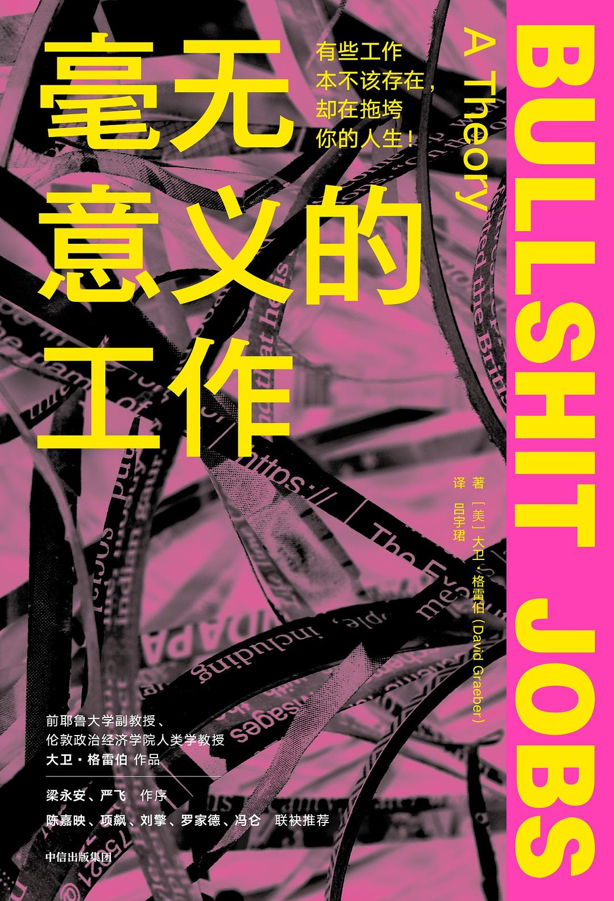

# 第一期：不工作，我们还能做什么？

::: info 活动状态
第一期活动正在筹备中，欢迎报名参与！
:::

## 📚 本期共读

### 《工作、消费主义和新穷人》
**作者：** 齐格蒙·鲍曼  
**出版社：** 上海城市出版社  
**页数：** 约 200 页

#### 核心观点
- 从生产社会向消费社会的转变
- "新穷人"不再是生产的后备军，而是"有缺陷的消费者"
- 消费主义如何重塑我们的身份认同

#### 推荐理由
鲍曼的社会学分析帮助我们理解消费文化如何塑造现代人的生活方式和价值观念。

### 《毫无意义的工作》
**作者：** 大卫·格雷伯  
**出版社：** 中信出版社  
**页数：** 约 400 页

#### 核心观点
- 现代社会存在大量"狗屁工作"（Bullshit Jobs）
- 这些工作对社会没有实际贡献，却占据了人们的大部分时间
- 探讨工作的真正意义与价值创造的本质

#### 推荐理由
格雷伯以人类学家的敏锐视角，揭示了现代工作制度的荒诞性，让我们重新思考工作与生活的关系。

## 🎯 活动设计

我们准备了两种探索模式，具体采用哪种将由参与者共同决定：

### 模式一：结构化深潜 🔍

**适合**：喜欢深度思辨、系统性探讨的朋友

#### 破冰与沉浸（30分钟）
- **放下仪式**：将手机放入"时间胶囊"，象征性地与外界断联
- **无意义故事会**：每人分享一个自己经历过的"无意义工作"片段
- **建立安全空间**：约定交流规则，营造开放包容的氛围

#### 思想的碰撞（90分钟）
- **核心概念卡牌**：通过卡牌形式讨论关键概念（如"狗屁工作"、"有意义的劳动"等）
- **"意义"的光谱**：将不同工作类型放在意义光谱上，探讨评判标准
- **个人经验映射**：结合书中理论分析自己的工作经历
- **社会制度思辨**：讨论当前经济制度的合理性与可能的替代方案

#### 创造与升华（60分钟）
- **反-狗屁工作设计**：小组合作设计真正有意义的工作模式
- **给未来自己的信**：写一封关于工作与生活平衡的信
- **带走一句话**：每人分享今天最触动自己的一个观点

### 模式二：游戏化冒险 🎲

**适合**：喜欢轻松氛围、创意互动的朋友

#### 工作身份卡游戏
- 每人抽取一张"工作身份卡"
- 从该身份角度为自己的工作"辩护"
- 其他人扮演"意义法官"进行质询
- **目的**：通过角色扮演审视我们对不同职业的预设与偏见

#### 价值观拍卖会
- 用虚拟货币竞拍不同的"价值观商品"
- 如：有意义的工作、高薪、社会地位、自由时间等
- 通过竞拍过程揭示内心真正的价值排序
- **目的**：认识自己的真实需求与社会期待的冲突

#### 消费主义诊断室
- 扮演"消费心理医生"为其他人的消费行为"诊断"
- 运用书中理论分析现代消费文化的影响
- 开出"治疗处方"：如何在消费社会中保持清醒
- **目的**：将理论知识应用于现实生活

#### 理想社会设计大会
- 小组合作设计一个没有"狗屁工作"的理想社会
- 考虑经济制度、技术发展、人际关系等多个维度
- 制作简易模型或图表展示设计方案
- **目的**：从批判走向建构，发挥集体创造力

## 📅 活动信息

| 项目 | 详情 |
|------|------|
| **时间** | [具体日期] 周六/日下午 2:00 - 5:00 |
| **地点** | [具体地址待定] - 一个安静舒适的交流空间 |
| **人数** | 4-6人（深度而非广度） |
| **费用** | AA制（场地费用、茶水点心等） |
| **主理人** | [主理人姓名] |

## 🎒 参与准备

### 必备物品
- [ ] 阅读完成的书籍（至少一本）
- [ ] 笔记本和笔
- [ ] 开放好奇的心态

### 阅读建议
- **最低要求**：完整阅读其中一本书
- **推荐做法**：两本都读完，会有更丰富的思考碰撞
- **阅读方法**：边读边记录触动你的段落和自己的思考

### 思考题（可选）
1. 在你的工作经历中，有没有过"这份工作毫无意义"的感受？
2. 你如何定义"有意义的工作"？
3. 如果不需要为生存而工作，你最想做什么？
4. 消费给你带来的快乐是真实的吗？还是短暂的？
5. 在你的理想社会中，人们应该如何度过一天？

## 📞 报名方式

想要参与这次思想探险？请联系：

- **微信**：[主理人微信号]
- **邮箱**：[邮箱地址]
- **电话**：[联系电话]

**报名截止**：[具体日期]

---

*"工作占据了我们生命的大部分时间，如果我们不能让它变得有意义，那我们就是在浪费生命。" —— 让我们一起寻找工作的真正意义。* 